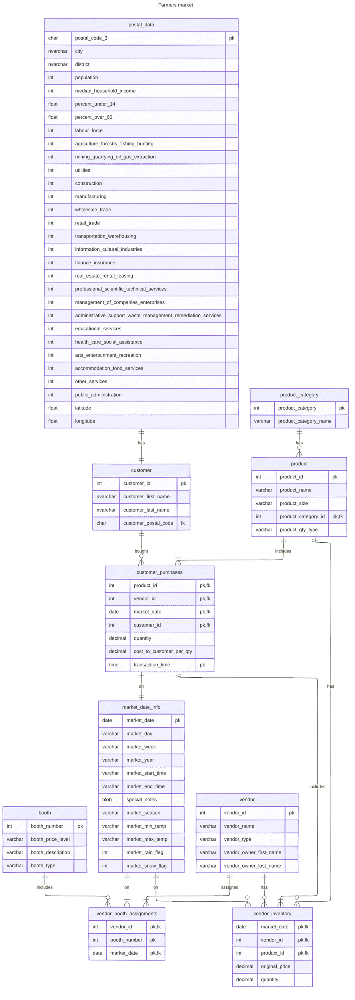

```mermaid
---
title: Farmers market
config:
  layout: elk
  look: handDrawn
  theme: mermaid
---
erDiagram
	b[booth] {
		int booth_number pk
		varchar booth_price_level
		varchar booth_description
		varchar booth_type
	}
	c[customer] {
		int customer_id pk
		nvarchar customer_first_name
		nvarchar customer_last_name
		char customer_postal_code fk
	}
	cp[customer_purchases] {
		int product_id pk,fk
		int vendor_id pk,fk
		date market_date pk,fk
		int customer_id pk,fk
		decimal quantity
		decimal cost_to_customer_per_qty
		time transaction_time pk 
	}
	md[market_date_info] {
		date market_date pk
		varchar market_day
		varchar market_week
		varchar market_year
		varchar market_start_time
		varchar market_end_time
		blob special_notes
		varchar market_season
		varchar market_min_temp
		varchar market_max_temp
		int market_rain_flag
		int market_snow_flag
	}
	pd[postal_data] {
		char postal_code_3 pk
		nvarchar city
		nvarchar district
		int population
		int median_household_income
		float percent_under_14
		float percent_over_65
		int labour_force
		int agriculture_forestry_fishing_hunting
		int mining_quarrying_oil_gas_extraction
		int utilities
		int construction
		int manufacturing
		int wholesale_trade
		int retail_trade
		int transportation_warehousing
		int information_cultural_industries
		int finance_insurance
		int real_estate_rental_leasing
		int professional_scientific_technical_services
		int management_of_companies_enterprises
		int administrative_support_waste_management_remediation_services
		int educational_services
		int health_care_social_assistance
		int arts_entertainment_recreation
		int accommodation_food_services
		int other_services
		int public_administration
		float latitude
		float longitude
	}
	p[product] {
		int product_id pk
		varchar product_name
		varchar product_size
		int product_category_id pk,fk
		varchar product_qty_type
	}
	pc[product_category]{
		int product_category pk
		varchar product_category_name
	}
	v[vendor] {
		int vendor_id pk
		varchar vendor_name
		varchar vendor_type
		varchar vendor_owner_first_name
		varchar vendor_owner_last_name
	}
	vb[vendor_booth_assignments] {
		int vendor_id pk,fk
		int booth_number pk
		date market_date pk,fk
	}
	vi[vendor_inventory] {
		date market_date pk,fk
		int vendor_id pk,fk
		int product_id pk,fk
		decimal original_price
		decimal quantity
	}
	pd ||--|| c : has
	pc ||--o{ p : has
	c ||--o{ cp : bought
	p ||--|{ cp : includes
	cp ||--|{ vi : includes
	cp ||--|| md : on
	p ||--o{ vi : has
	md ||--o{ vi : on
	v ||--o{ vi : has
	md ||--|{ vb : on
	v ||--|{ vb : assigned
	b ||--o{ vb : includes
```